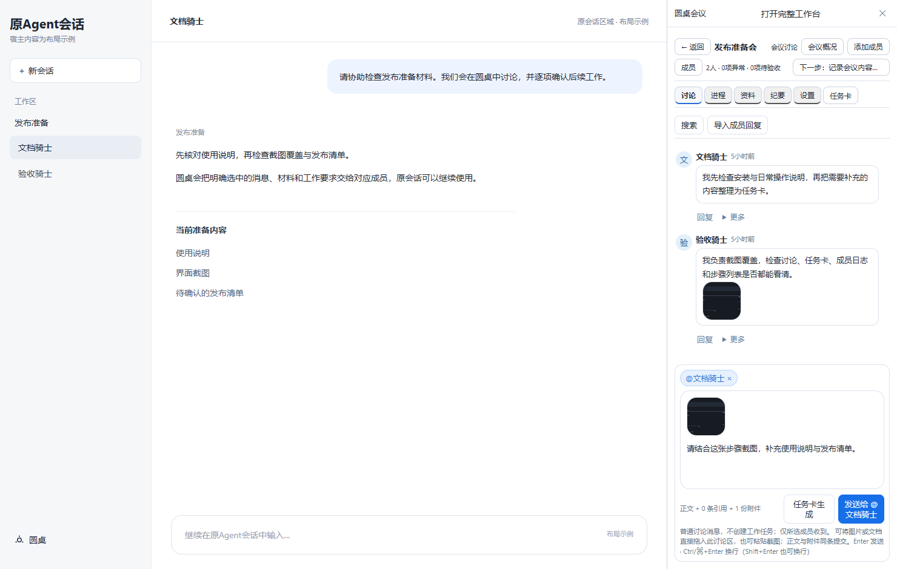
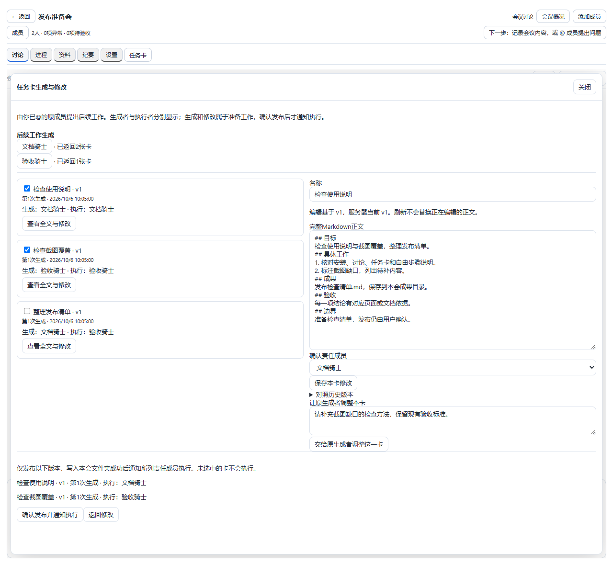
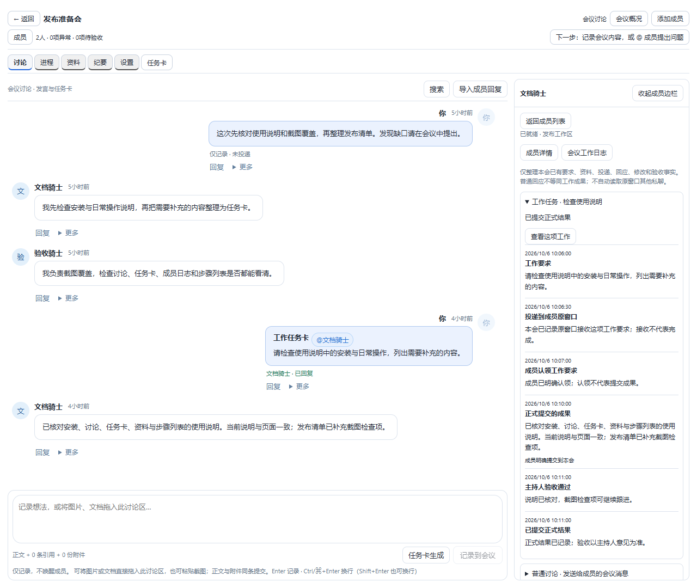
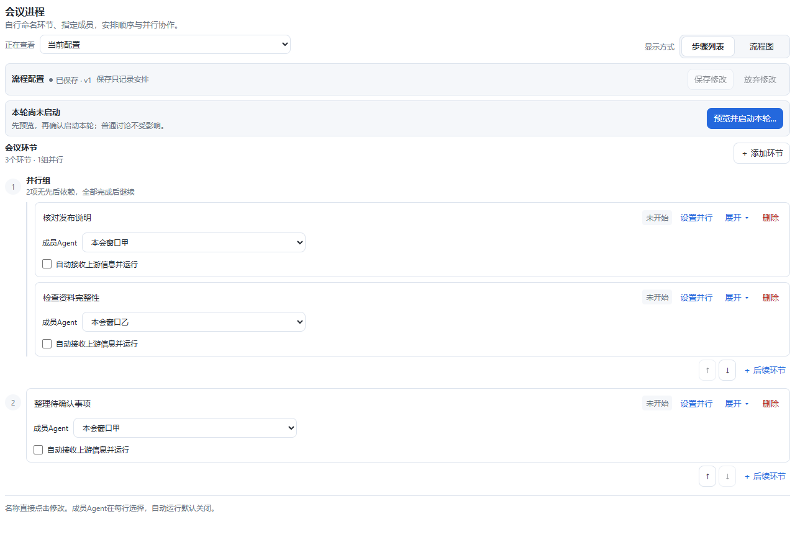
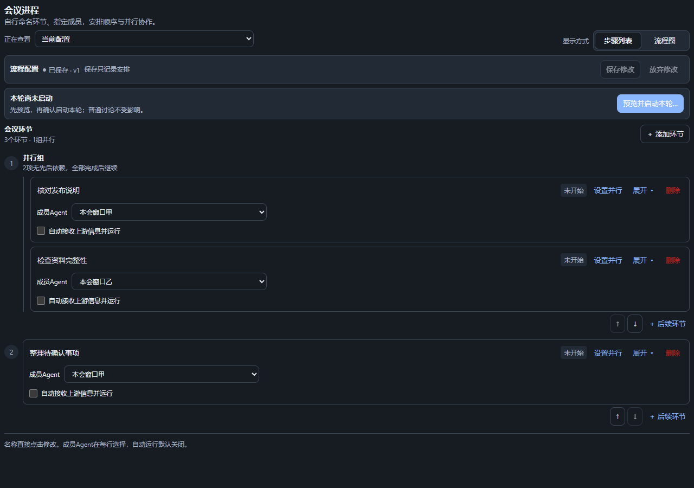
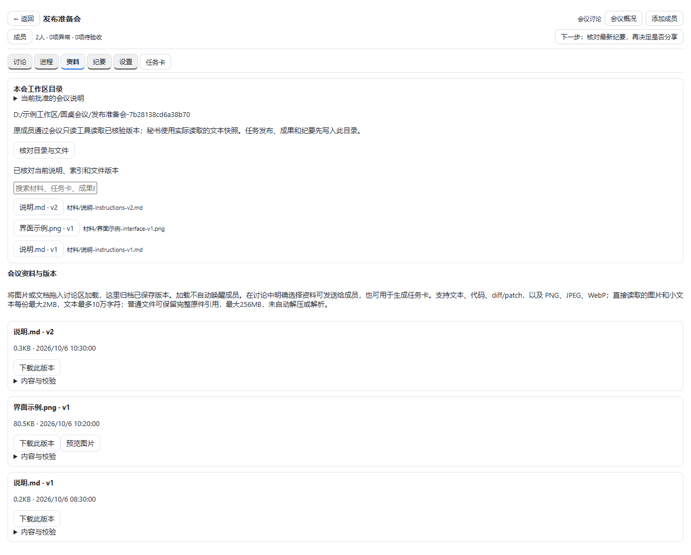
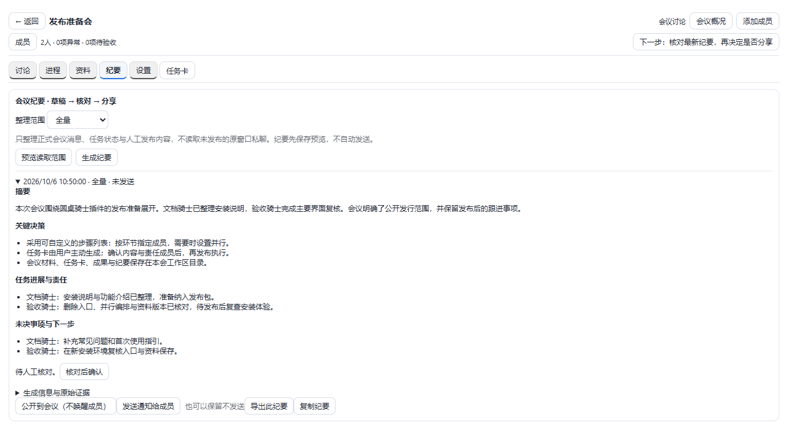

# dsh-round-table

[中文](README.md) | **English**

Bring existing Agent sessions into one meeting for discussion, collaboration and delivery. Send ordinary questions directly. For work, ask selected members to generate task cards, review them and confirm publication. Member logs, shared materials, free steps and dedicated secretary minutes stay together; members keep their original sessions and context.

**Current version: 1.0.0.** Only the version number changes; functionality retains the accepted 0.1.18 baseline.

## Installation

**Host requirement: Windows DeepSeek Harness 0.2.0-rc.2 with the desktop profile.** Add `dsh-round-table@1.0.0` from the desktop **Plugins** page, then **Quit** through the application menu or tray and reopen it. Select Round table in the sidebar. Closing the window may leave the app running.

Alternatively, quit the app first and use its bundled CLI. A bare `dsh` on PATH may belong to another installation:

```powershell
$desktopCli = Join-Path $env:LOCALAPPDATA 'Programs/DeepSeek Harness/resources/runtime/cli/bin/dsh.cmd'
& $desktopCli --version   # Must be 0.2.0-rc.2
& $desktopCli plugin --profile desktop add 'dsh-round-table@1.0.0'
```

[npm version entry](https://www.npmjs.com/package/dsh-round-table/v/1.0.0) · [GitHub Release and local archive](https://github.com/whateverboy2333/dsh-round-table/releases/tag/v1.0.0) · [Full installation, build and recovery guide](docs/配置指南.md#english-guide)

## Start in five steps

1. **Create and invite:** Enter the goal, background and workspace. Invite existing sessions or create members from host presets. Creation sends briefings and members may respond; each meeting has its own secretary.
2. **Discuss first:** Type `@` and select members from the menu to send ordinary questions. With no recipients, only record to the meeting. Drag files or paste screenshots. Enter sends/records; Ctrl/Cmd+Enter inserts a newline.
3. **Generate work cards when needed:** Select members, then choose Generate task cards. Extra prose may be empty; each item becomes one card. Generation and adjustments do not execute the proposed work. There is no automatic intent-based dispatch.
4. **Review and publish:** Edit directly or ask the original generator to adjust a card. Save, confirm assignees and select versions, then confirm publication. Approved files are written before execution notifications. Formal submission and human acceptance are separate.
5. **Follow progress:** Use the right member log for replies and work state. Arrange repeatable collaboration in Process. Generate secretary minutes on demand, review the draft, then choose publication, notifications or export.

## Interface and usage

These are **0.1.18 production React interfaces** with synthetic meetings, members and materials, **not real Agent execution results**. The main window is a layout example.

### Discussion beside the original window

A 380px drawer reflows the original page beside it. Drag to resize; reopening resets the width. Text and attachments send together; upload only archives. Agent image reading depends on the selected model.



### Task cards: generate, edit and choose publication

Generators and assignees are distinct. Originals, edits and AI suggestions retain versions; late suggestions never overwrite user edits. Only confirming chosen versions authorizes execution notifications.



### Member details and meeting work log

The right sidebar gathers this meeting's materials, delivery, replies, results and review. Execution restores the same original session when needed; archived, deleted or unverified identities require attention, never a replacement context.



### Free steps: sequence, parallel work and deletion

Start empty, edit titles in place and assign a member in every row; reuse an Agent across steps. Any stage can become parallel. Delete is visible in each header and automatic execution is off by default. Saving only records the arrangement. Initial confirmation starts the first stage and authorizes selected future automatic rules; unchecked future steps remain manual. Active topology and started fields are frozen; old graphs and history remain.



<details>
<summary>View the dark step list</summary>



</details>

### Materials and the meeting directory

Every successfully uploaded document, image and version is archived; removing a draft reference keeps the original. A dedicated workspace directory stores materials, approved cards, results and minutes. Members read exact approved versions.



### Secretary minutes

Generate a draft, then review sources and task facts. Publishing adds a meeting record; notifying wakes members. Keeping a draft without sending is valid. Minutes do not certify that all generated content is correct.



## Limits

- Only the specified desktop version is supported. Members share one DSH process; run one queue host per DSH_HOME. Cross-machine collaboration and scheduled minutes are unsupported.
- Logs never automatically publish unrelated private conversations. Original context and file permissions remain; selected evidence is not a permission sandbox. The secretary does not execute member work.
- Image delivery needs adapter support; the current DeepSeek adapter does not support it. PDF, Office and archives can retain complete originals without automatic parsing or extraction. See [format and size limits](docs/配置指南.md#materials-and-minutes).
- Saving a process does not start work. Card generation or adjustment asks members to analyze; confirming publication executes the card's work. Minutes generation also uses a model. Delivery, submission and acceptance differ. Verify uncertain requests before retrying; retries may duplicate work. Execution budgets are not token or monetary caps.
- Back up before upgrading. Permanent meeting deletion needs a second confirmation and has no recycle bin; ordinary members and workspace files remain. Stopping a meeting does not stop an original Agent. Rollback needs a complete backup.

## Further reading and maintenance

[Full bilingual usage guide](docs/配置指南.md) · [PRD](docs/PRD.md) · [ENGINEERING](docs/ENGINEERING.md) · [Tools / HTTP API](docs/产品实现速查.md) · [Agent handoff](CLAUDE.md)

Public `npm run verify` checks types and package contents. The internal 124 regression suites and 225 browser checks are not distributed here. Main documentation may change; the v0.1.18 tag and released assets remain fixed.

MIT © whateverboy2333
